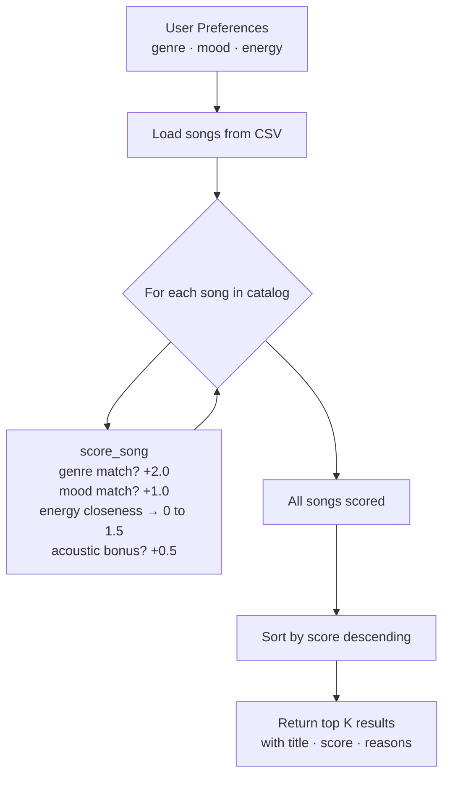
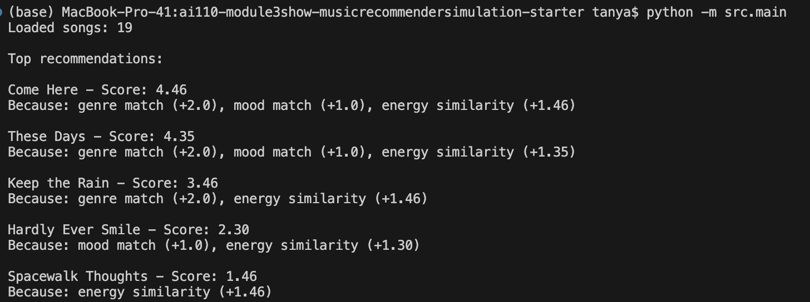
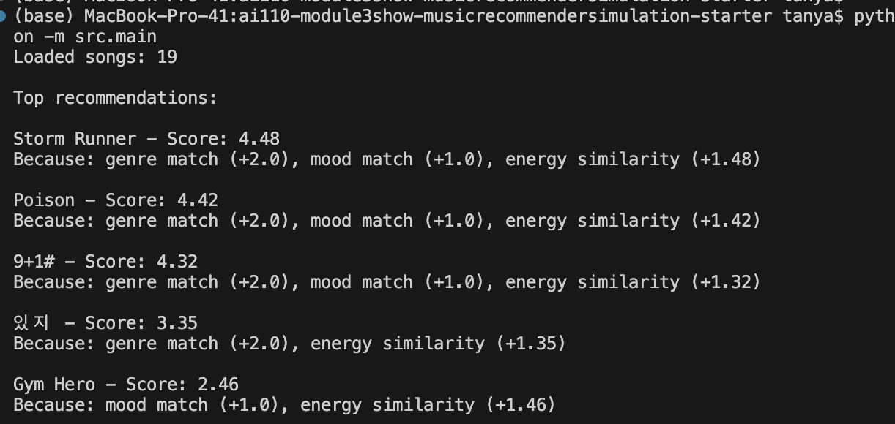
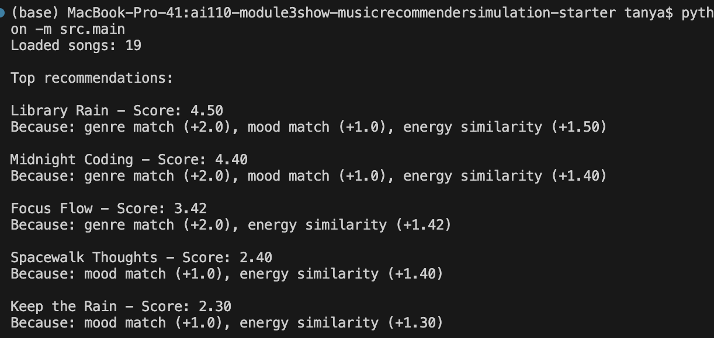

# Music Recommender Simulation

## Project Summary

I built a simple music recommender that takes a user's taste preferences and scores songs based on how well they match. The goal was to understand how a real recommender might work at a basic level: what data it needs, how it turns that data into a ranking, and where it can go wrong.

---

## How The System Works

Real platforms like Spotify use two main approaches:

**Collaborative filtering** looks at what other people with similar taste liked. It finds patterns across users without caring about the actual content of the songs.

**Content-based filtering** looks at the song's actual features — genre, mood, energy, etc. — and matches them to what the user prefers. That's what I built here, because I have song attributes but no user history.

### Features each `Song` uses

genre, mood, energy (0.0–1.0 scale), tempo_bpm, valence, danceability, acousticness

### What `UserProfile` stores

favorite_genre, favorite_mood, target_energy, likes_acoustic

### Scoring logic

| Signal | Points |
|---|---|
| Genre match | +2.0 |
| Mood match | +1.0 |
| Energy closeness: `(1 - gap) × 1.5` | 0 to 1.5 |
| Acoustic bonus (if likes_acoustic and acousticness > 0.7) | +0.5 |

I weighted genre the highest because in my experience that's usually the strongest filter. Energy gets a sliding scale instead of a yes/no because its hard to quantize that. Acoustic tracks are given a bonus based on user perference.

### Data flow



---

## Getting Started

### Setup

1. Create a virtual environment (optional):

   ```bash
   python -m venv .venv
   source .venv/bin/activate      # Mac or Linux
   .venv\Scripts\activate         # Windows
   ```

2. Install dependencies:

   ```bash
   pip install -r requirements.txt
   ```

3. Run:

   ```bash
   python -m src.main
   ```

### Tests

```bash
pytest
```

---

## Experiments

### Profile 1 — My default taste (folk, melancholy, low energy)


Top results were *Come Here*, *These Days*, *Keep the Rain* — all very quiet, acoustic folk songs. That matched the profile. The lofi tracks came up mid-list too because their energy was close even though genre didn't match.

### Profile 2 — High energy rock (rock, intense, 0.9)


*Poison*, *9+1#*, *Storm Runner* all floated to the top. *있지* also appeared even though it's "moody" not "intense" — the energy (0.80) was close enough to pull it up. 

### Profile 3 — Chill lofi (lofi, chill, 0.35)


*Library Rain* and *Midnight Coding* dominated because they matched on genre AND mood. Didn't get much variety here — only three lofi songs in the catalog so the top 3 was basically automatic.

### Weight shift experiment

I doubled the energy weight to 3.0 and cut genre to 1.0. The folk/melancholy profile started recommending lofi and ambient tracks instead of actual folk — they had similar low energy so they rose in rank. Showed me how much the weights control the whole vibe of results.

### Feature removal experiment

Took out mood scoring for the folk/melancholy profile. *Spacewalk Thoughts* (ambient/chill) jumped up above *Strangers* (indie/moody). Without mood, the system couldn't tell apart "quiet and sad" from "quiet and spacey."

---

## Limitations

- Only 19 songs. Some profiles just don't have enough options to show real variety.
- Genre matching is binary — "indie" and "folk" are treated as totally different even though they overlap a lot in practice.
- No memory. Every run is the same. If I skip a song, nothing changes.
- The top results can all be the same genre. No diversity logic.

---

## Reflection

The biggest thing I learned is how sensitive the results are to the weights. Changing genre from 2.0 to 1.0 completely changed the output, even though the songs themselves didn't change at all. That felt kind of scary — it means the designer's assumptions are basically encoded into every recommendation, and most users have no idea.

I also noticed how quickly the catalog size becomes a problem. With only 19 songs, certain profiles basically get the same 3 results every time. Real platforms avoid this with massive catalogs and diversity rules.

---

*See [model_card.md](model_card.md) for the full model card.*
